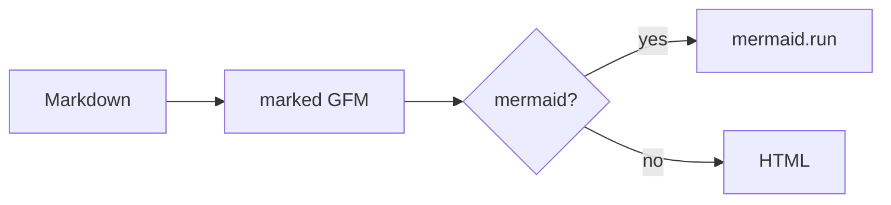

# jwebkit markdown fixture

GFM table, task list, strikethrough, and a mermaid fence for manual preview.

## Table

| Feature | Status |
|--------:|:-------|
| GFM tables | yes |
| Task lists | yes |
| ~~Strikethrough~~ | kept |

## Tasks

- [x] Ship viewer HTML/CSS/JS
- [ ] Try `M-x jwebkit-open-markdown` on this file
- [ ] Hit `r` / `gr` after editing and saving

Autolink: https://github.com/

## Mermaid

